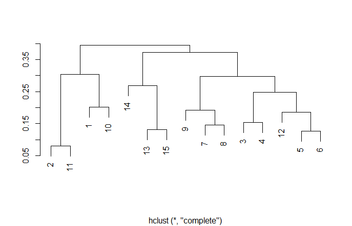
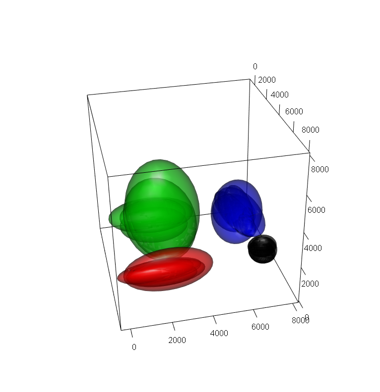
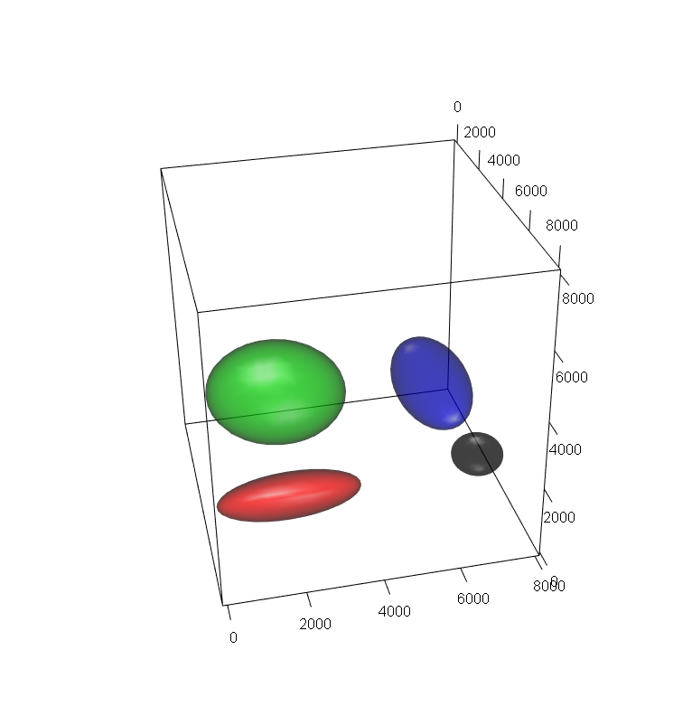
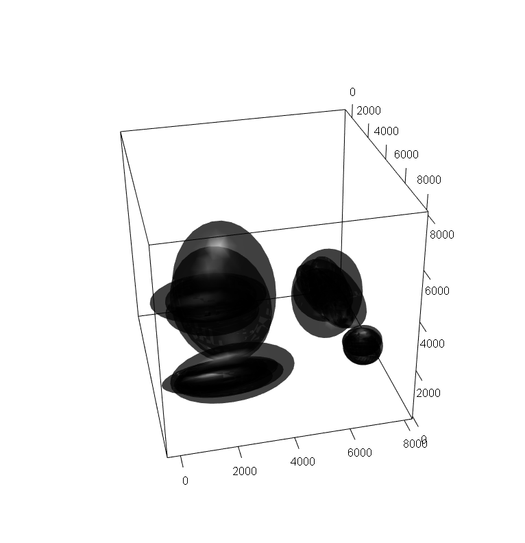
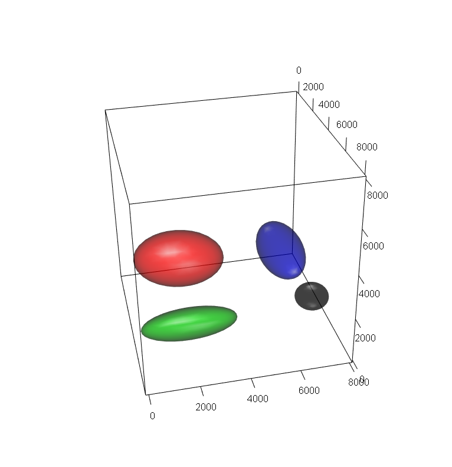
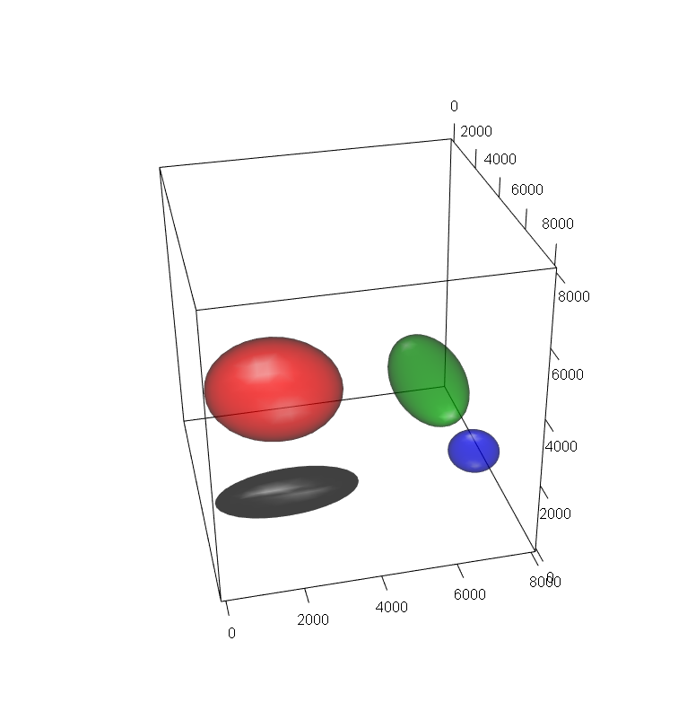

```{r setup, include=FALSE}
knitr::opts_chunk$set(echo = TRUE)
```

# Introduction

*optimalFlow* is a package dedicated to applying optimal-transport techniques to supervised flow cytometry gating based on the results in @optimalFlow.

We provide novel methods for grouping (clustering) gated cytometries. By clustering a set of cytometries we are producing groups (clusters) of cytometries that have lower variability than the whole collection.  This in turn allows to improve greatly the performance of any supervised learning procedure. Once we have a partition (clustering) of a collection of cytometries, we provide several methods for obtaining an artificial cytometry (prototype, template) that represents in some optimal way the cytometries in each respective group. These prototypes can be used, among other things, for matching populations between different cytometries. Even more, a procedure able to group similar cytometries could help to detect individuals with a common particular condition, for instance some kind of disease.

*optimalFlowTemplates* is our procedure for clustering cytometries and obtaining templates. It is based on recent developments in the field of optimal transport such as a *similarity distance* between clusterings and a *barycenter* (Frechet mean) and *k-barycenters* of probability distributions.

We introduce *optimalFlowClassification*, a supervised classification tool for the case when a database of gated cytometries is available. The procedure uses the prototypes obtained by *optimalFlowTemplates* on the database. These are used to initialize *tclust*, a robust extension of k-means that allows for non-spherical shapes, for gating a new cytometry (see @tclust). By using a similarity distance between the best clustering obtained by *tclust* and the artificial cytometries provided by *optimalFlowTemplates* we can assign the new cytometry to the most similar template (and the respective group of cytometries). We provide several options of how to assign cell types to the new cytometry using the most relevant information, represented by the assigned template and the respective cluster of cytometries.

# Installation

Installation procedure:

```{r ej00, eval = FALSE}
if (!requireNamespace("BiocManager", quietly = TRUE))
    install.packages("BiocManager")

BiocManager::install("optimalFLow")
```

# optimalFlowTemplates

```{r ej0, echo = TRUE, message = FALSE}
library(optimalFlowData)
library(optimalFlow)
library(ellipse)
```
We start by providing a database of gated cytometries. In this case we select as a learning set 15 cytometries of healthy individuals, from the data provided in optimalFlowData. We will use Cytometry1 to test the results of our procedures. For simplicity and for the sake of a good visualisation we will select only some of the cell types, in particular a subset of 4 cell types. 
```{r ej1, echo = TRUE}
database <- buildDatabase(
 dataset_names = paste0('Cytometry', c(2:5, 7:9, 12:17, 19, 21)),
   population_ids = c('Monocytes', 'CD4+CD8-', 'Mature SIg Kappa', 'TCRgd-'))
```
Then we apply optimalFlowTemplates to obtain a clustering of the database and a template cytometry for each group. 
```{r ej1110, eval = FALSE}
templates.optimalFlow <-
  optimalFlowTemplates(
    database = database
    )
```
When running the default mode for optimalFlowTemplates we obtain a plot as in the figure bellow and then we are asked how many clusters we want to look for.

From the plot it seems reasonable to look for 5 clusters of cytometries and we could introduce 5 and press enter, and the procedure will give us a clustering of the learning database and the respective templates. Since this is hard to show in a vignette, an equivalent way of doing this procedure is to execute the command bellow, where we ask for 5 clusters directly.
```{r ej111, echo = TRUE}
templates.optimalFlow <-
  optimalFlowTemplates(
    database = database, templates.number = 5, cl.paral = 1
    )
```
Now let us understand what does optimalFlowTemplates return. In the entry templates we have the artificial cytometries, viewed as mixtures of multivariate normal distributions, corresponding to the clustering of the cytometries in the database argument.
```{r ej1112, echo = TRUE}
length(templates.optimalFlow$templates) # The number of clusters, and, hence, of templates 
length(templates.optimalFlow$templates[[1]]) # The number of elements of the first template, it contains four cell types
templates.optimalFlow$templates[[1]][[1]] # The first element of the first template
```
In the argument clustering we have the clustering of the cytometries in the database argument.
```{r ej1113, echo = TRUE}
templates.optimalFlow$clustering
```
In the argument database.elliptical we have a list containing each cytometry in the database viewed as a mixture distribution. Each element of the list is a cytometry viewed as a mixture.
```{r ej1114, echo = TRUE}
length(templates.optimalFlow$database.elliptical) # the number of elements in the database
length(templates.optimalFlow$database.elliptical[[1]]) # the number of cell types in the first element of the database
templates.optimalFlow$database.elliptical[[1]][[1]] # the parameters corresponding to the first cell type in the first cytometry of the database 
```
In order to get some intuition about our methodology we are going to give some visual examples. Users can do it for their own data once they have applied optimalFlowTemplates.

We start with a two-dimensional representation of the cytometries of the cluster labelled as 3. As we have gated cytometries in the database we know every cell type, and, even more, we can consider every cytometry as a mixture of multivariate Gaussian distributions and this is stored in templates.optimalFlow$database.elliptical. The user just has to select the variables in which to project the cytometries through the variable dimensions.
```{r ej2, echo = TRUE}
cytoPlotDatabase(templates.optimalFlow$database.elliptical[which(templates.optimalFlow$clustering == 3)], dimensions = c(4,3), xlim = c(0, 8000), ylim = c(0, 8000), xlab = "", ylab = "")
```
Black ellipses correspond to the cell type CD4+CD8- in each cytometry and enclose 95% of the probability for the respective multivariate normal distributions. Red ellipses correspond to Mature Sig Kappa and so on.

A three-dimensional plot of the same case is provided as a static image and can be obtained using the following code.
```{r ej22, eval = FALSE}
cytoPlotDatabase3d(templates.optimalFlow$database.elliptical[which(templates.optimalFlow$clustering == 3)], dimensions = c(4, 3, 9), xlim = c(0, 8000), ylim = c(0, 8000), zlim = c(0, 8000))
```


optimalFlowTemplates provides a template cytometry for each cluster, stored in the entry templates. We present here how to visualize in 2d the consensus cytometry, the template, corresponding to cluster 3. Recall that the cytometries belonging to cluster 3 have been plotted above. The code is straightforward, we access templates in templates.optimalFlow and select the third element of the list, since we are interested in cluster 3.
```{r ej3, echo = TRUE}
cytoPlot(templates.optimalFlow$templates[[3]], dimensions = c(4,3), xlim = c(0, 8000), ylim = c(0, 8000), xlab = "", ylab = "")
```
A three dimensional plot of the same case is provided as a static image and can be obtained using the following code.
```{r ej32, eval = FALSE}
cytoPlot3d(templates.optimalFlow$templates[[3]], dimensions = c(4, 3, 9), xlim = c(0, 8000), ylim = c(0, 8000), zlim = c(0, 8000))
```


It is clear that the prototype cytometry represents well the geometric information of the respective group of cytometries. This visualisation schemes allow users to check by themselves if the templates that they are obtaining are satisfying and if their clusters are really homogenous.

Another relevant situation in flow cytometry is when gatings of cytometries are available but without the identification of each cell type. For the cytometries of cluster 3 it is like we forgot about the colour, since now we do not have cell types identified. 
```{r ej4, echo = TRUE}
cytoPlotDatabase(templates.optimalFlow$database.elliptical[which(templates.optimalFlow$clustering == 3)], dimensions = c(4,3), xlim = c(0, 8000), ylim = c(0, 8000), xlab = "", ylab = "", colour = FALSE)
```
The respective 3d static image can be obtained using the following code.
```{r ej42, eval = FALSE}
cytoPlotDatabase3d(templates.optimalFlow$database.elliptical[which(templates.optimalFlow$clustering == 3)], dimensions = c(4, 3, 9), xlim = c(0, 8000), ylim = c(0, 8000), zlim = c(0, 8000), colour = FALSE)
```

From a visual inspection there is enough geometrical information that allows us to differentiate the cel types. It is just a matter of how to capture it.

Indeed, using some unsupervised procedure to obtain the consensus element (the prototype cytometry) should be enough to capture the relevant cluster structure. This can be achieved using *otpimalFlowTemplates* as follows.

In the following chunk of code we are using optimalFlowTemplates on our database, we are again looking for 5 clusters with the default clustering procedure which is hierarchical complete-linkage but now we vary the consensus.method variable. We are selecting to obtain the template cytometry using k-barycenters in the Wasserstein space, where k is set to be 4.
```{r ej5, echo = TRUE}
templates.optimalFlow.barycenter <- 
  optimalFlowTemplates(
    database = database, templates.number = 5, consensus.method = "k-barycenter",
    barycenters.number = 4, bar.repetitions = 10, alpha.bar = 0.05, cl.paral = 1
    )
```
A different way of obtaining the consensus cytometry is to use density based hierarchical clustering, in this case hdbscan, setting consensus.method = "hierarchical". The advantage of this is that the number of cell types in the template cytometry is selected automatically.
```{r ej52, echo = TRUE}
templates.optimalFlow.hdbscan <- 
  optimalFlowTemplates(
    database = database, templates.number = 5, consensus.method = "hierarchical",
    cl.paral = 1
    )
```
As before, we can check how well the prototypes represent the group of cytometries. Again, we work with cluster 3. A 2d plot of the prototype cytometry obtained when using a 4-barycenter is provided, where colours represent different groups.
```{r ej6, echo = TRUE}
cytoPlot(templates.optimalFlow.barycenter$templates[[3]], dimensions = c(4,3), xlim = c(0, 8000), ylim = c(0, 8000), xlab = "", ylab = "")
```
A three dimensional plot of the same case is provided as a static image and can be obtained using the following code.
```{r ej62, eval = FALSE}
cytoPlot3d(templates.optimalFlow.barycenter$templates[[3]], dimensions = c(4, 3, 9), xlim = c(0, 8000), ylim = c(0, 8000), zlim = c(0, 8000))
```


We do the same for the density based hierarchical clustering.
```{r ej7, echo=TRUE}
cytoPlot(templates.optimalFlow.hdbscan$templates[[3]], dimensions = c(4,3), xlim = c(0, 8000), ylim = c(0, 8000), xlab = "", ylab = "")
```
```{r ej72, eval = FALSE}
cytoPlot3d(templates.optimalFlow.hdbscan$templates[[3]], dimensions = c(4, 3, 9), xlim = c(0, 8000), ylim = c(0, 8000), zlim = c(0, 8000))
```

From the visual representations of above we see that the different methods for obtaining a prototype cytometry for the cluster of cytometries labelled as 3 are returning similar results. Even more, results do seem to summarize in a reasonable way the information contained in the cytometries of cluster 3. Hence, doing some 2 or 3-dimensional visual inspection of the results is advisable for the user and it allows for an informed inspection of our procedures.


A totally unsupervised way of obtaining groups and templates is given by using density-based hierarchical clustering both when clustering the database of cytometries and when obtaining the prototype cytometry.
```{r ej77, echo = TRUE}
templates.optimalFlow.unsup <-
  optimalFlowTemplates(
    database = database, hclust.method = "hdbscan", cl.paral = 1, consensus.method = "hierarchical"
    )
print(templates.optimalFlow.unsup$clustering)
print(templates.optimalFlow$clustering)
cytoPlot(templates.optimalFlow.unsup$templates[[5]], dimensions = c(4,3), xlim = c(0, 8000), ylim = c(0, 8000), xlab = "", ylab = "")
```

# optimalFlowClassification
Once we have a grouped database with prototype cytometries for each group we can apply different supervised classification procedures to classify a new ungated cytometry.

We start by selecting a test cytometry which we will treat as a cytometry that we want to classify in order to see how our supervised classification methods work.
```{r ej80, echo = TRUE}
test.cytometry <- Cytometry1[which(match(Cytometry1$`Population ID (name)`, c("Monocytes", "CD4+CD8-", "Mature SIg Kappa", "TCRgd-"), nomatch = 0) > 0), ]
```
Let us begin with, essentially, the default method for using optimalFlowClassification. It consists in doing quadratic discriminant analysis using the most similar template.
```{r ej8, echo = TRUE}
classification.optimalFlow <- 
  optimalFlowClassification(
    test.cytometry[, 1:10], database, templates.optimalFlow, 
    consensus.method = "pooling", cl.paral = 1
    )
```
In order to execute properly our supervised classifications we need to provide the new cytometry we want to classify, in our case it is test.cytometry without the label information. Then we need to provide the database in which we have applied optimalFlowTemplates, the object returned by optimalFlowTemplates and the consensus.method that we have used in optimalFlowTemplates. This is necesary in order to be able to perform correctly the classification task.

The result we obtain is a list that we will analyse here to make the user familiar with it. The first argument is a clustering of the cytometry of interest.
```{r ej82, echo = TRUE}
head(classification.optimalFlow$cluster)
table(classification.optimalFlow$cluster)
```
The argument clusterings contains the initial unsupervized or semi-supervized clusterings of the cytometry of interest. It is itself a list that can have as much entries as the number of templates in the semi-supervized case, or only one entry in the case of initial.method = "unsupervized". The relevant argument for the clusterings is cluster.
```{r ej83, echo = TRUE}
length(classification.optimalFlow$clusterings)
table(classification.optimalFlow$clusterings[[1]]$cluster)
```
As we see the initial clustering is not the same as the final result.

Finally, we have an entry that indicates which prototype is the closest to the new cytometry. This information is relevant since it is the prototype used for classifying in the default execution of optimalFlowClassification.
```{r ej84, echo = TRUE}
classification.optimalFlow$assigned.template.index
templates.optimalFlow$clustering
```
In this case test.cytometry is closest to the template corresponding to cluster 1 in templates.optimalFlow$clustering.

As we are performing supervised classification, a measure of how well our procedure works is in order. We have provided simple functions to calculate the median F-measure (see @optimalFlow for details). 
```{r ej85, echo = TRUE}
scoreF1.optimalFlow <- optimalFlow::f1Score(classification.optimalFlow$cluster,
                                            test.cytometry, noise.types)
print(scoreF1.optimalFlow)
```
We see that median F1-score, the first row in the table is close to 1 for each cell type, reflecting that classification is good for each cell type.

When using a consensus method that is not pooling, the default in optimalFlowTemplates, we have to assign cell types to the clusters in the prototype cytometries. This is done by voting, since our database is formed by gated cytometries and we have assigned cell types.
```{r ej9, echo = TRUE}
classification.optimalFlow.barycenter <-
  optimalFlowClassification(
    test.cytometry[, 1:10],
    database, templates.optimalFlow.barycenter, consensus.method = "k-barycenter", cl.paral = 1
    )
```

```{r ej92, echo = TRUE}
table(classification.optimalFlow.barycenter$cluster)
classification.optimalFlow.barycenter$cluster.vote
```
In this case the fuzzy classification is a hard one, since values of simple.proportion are all one. This means that label 1 is assigned to the entry in cell and so on.
```{r ej922, echo = TRUE}
classification.optimalFlow.barycenter$assigned.template.index
templates.optimalFlow.barycenter$clustering
```
Since usually the relabelling in classification.optimalFlow.barycenter$cluster.vote is fuzzy, we need to convert it to a hard clustering and then apply our median F-measure criteria. This is done as follows.
```{r ej93, echo = TRUE}
scoreF1.optimalFlow.barycenter <- 
  f1ScoreVoting(
    classification.optimalFlow.barycenter$cluster.vote, classification.optimalFlow.barycenter$cluster,
    test.cytometry,
    1.01, noise.types
    )
print(scoreF1.optimalFlow.barycenter$F1_score)
```

Exactly the same applies for the case of templates.optimalFlow.hdbscan.
```{r ej10, echo = TRUE}
classification.optimalFlow.hdbscan <-
  optimalFlowClassification(
    test.cytometry[, 1:10],
    database, templates.optimalFlow.hdbscan, consensus.method = "hierarchical", cl.paral = 1
    )
table(classification.optimalFlow.hdbscan$cluster)
classification.optimalFlow.hdbscan$cluster.vote
classification.optimalFlow.hdbscan$assigned.template.index
templates.optimalFlow.hdbscan$clustering
scoreF1.optimalFlow.hdbscan <-
  f1ScoreVoting(
    classification.optimalFlow.hdbscan$cluster.vote, classification.optimalFlow.hdbscan$cluster,
   test.cytometry,
    1.01, noise.types
  )
print(scoreF1.optimalFlow.hdbscan$F1_score)
```
Another way of doing classification is to relabel the initial clustering that we obtain using the most similar template obtained by optimalFlowTemplates. This is called label-transfer and is further explained in @optimalFlow.
```{r ej11, echo = TRUE}
classification.optimalFlow.2 <-
  optimalFlowClassification(
    test.cytometry[, 1:10],
    database, templates.optimalFlow, consensus.method = "pooling", classif.method = "matching",
    cost.function = "ellipses", cl.paral = 1
    )
table(classification.optimalFlow.2$cluster)
table(classification.optimalFlow.2$clusterings[[1]]$cluster)
classification.optimalFlow.2$cluster.vote
classification.optimalFlow.2$assigned.template.index
templates.optimalFlow$clustering
scoreF1.optimalFlow.2 <-
  f1ScoreVoting(
    classification.optimalFlow.2$cluster.vote, classification.optimalFlow.2$cluster,
    test.cytometry,
    1.01, noise.types
    )
print(scoreF1.optimalFlow.2$F1_score)
```
Also, classical techniques as random forest are available.
```{r ej12, echo = TRUE}
classification.optimalFlow.3 <-
  optimalFlowClassification(
    test.cytometry[, 1:10],
    database, templates.optimalFlow, consensus.method = "pooling",
    classif.method = "random forest", cl.paral = 1
    )
table(classification.optimalFlow.3$cluster)
classification.optimalFlow.3$assigned.template.index # the cytometry used for learning belongs to the cluster labelled as 1 and is the first of the cytometries in that cluster, hence it is the first cytometry in the database.
templates.optimalFlow$clustering
scoreF1.optimalFlow.3 <-
  optimalFlow::f1Score(classification.optimalFlow.3$cluster,
    test.cytometry,
    noise.types
    )
print(scoreF1.optimalFlow.3)
```

# References
